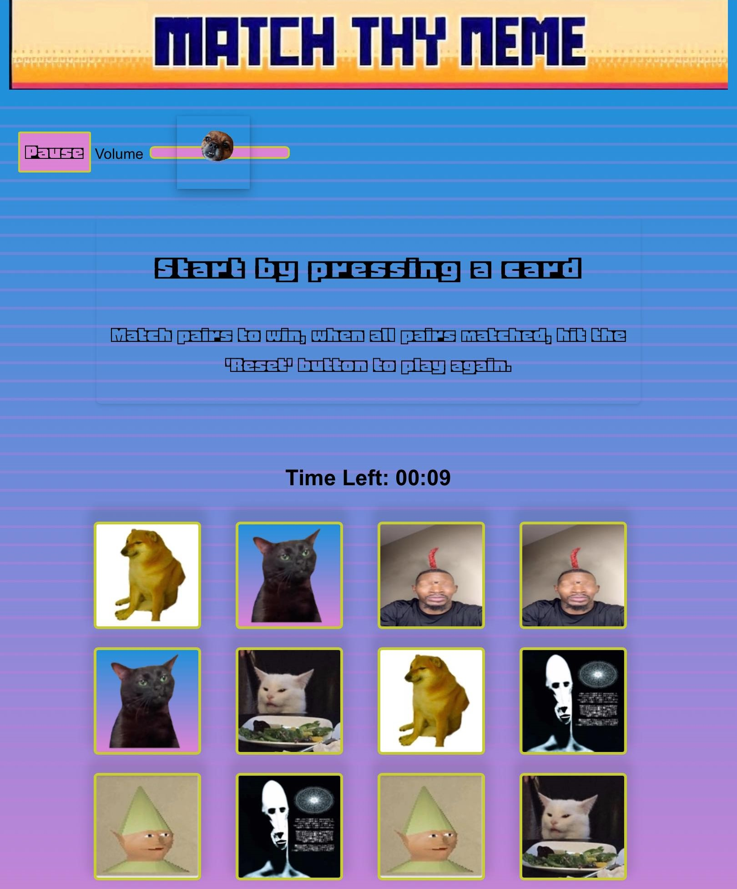
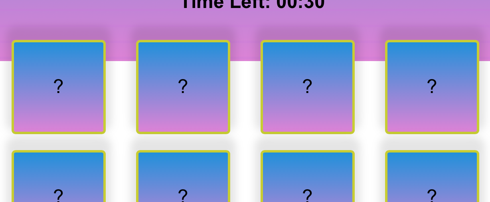

# Safri Browser Test

## Rundown

Throughout the development process, Safari || Apple devices in general have been a challenge. I've learned that Apple products respond to CSS styling differently due to how values are calculated. I've attempted to amend all visual discrepancies, but some remained unresolved.

## Discrepancies
 - Thumb slider

 - Reset Button

   
 - background malfunction

### Points
In the images above, the below points are represented
 - Strange semi transparent background on the vloume slider thumb.
 - Reset button is displaying as inteded 
 - White Space on background

## Diagnosis & Fixes

### White background Space (fix success)
#### Findings & Fix 
- After researching the white space issue that can occur across different browsers and operating systems, I learned that it can result from variations in how values and code are calculated.

  At the time of discovering this bug, my main element was using height: 100vh to take up the space on my page, which worked fine whilst viewing it on a live server.

  A Reddit post (which I can no longer find) suggested using height: 100% instead.
 With this information, I experimented with height: 100%, but it didn't resolve the issue. After further testing, I applied height: 100% to the body element and min-height: 100% to the main element—this worked perfectly and solved my issue.

----
### Reset Button (fix failed)
#### Findings & Fix
- The reset button bug still eludes me to this day. I tried researching the issue and applying multiple fixes but it still appears to not sit right. Despite the visual discrepancy, it hasn't affected the reset button's functionality, so it's not a game-breaking bug. 

  My attempts to fix this were based on my own knowledge. Since this issue still persists, I suspect that a deeper understanding of Apple devices and the Safari browser is key to resolving it.
----
### Semi-transparent background on thumb slider
#### Findings & fix
 - I used DevTools to inspect the element for any styling that could contribute to the issue. However, I couldn't find anything directly affecting the thumb slider's styling.

   I then noticed that the semi-transparent background was slightly off-centered relative to Gromit's face. I then inspected the original picture before background removal and it was apparent that the semi transparent background matched the position on the original picture. Since I removed the background using Microsoft Photos, I suspect that the difference in rendering on Safari may be due to how the two operating systems handle transparency. Since I do not possess the skill to rectify this issue further, I've decided to leave this bug as is for now. 

----
## Summary

- Despite some unresolved issues, this debugging process has been an invaluable learning experience. Navigating the quirks of Safari and Apple devices has deepened my understanding of CSS behavior across different devices and browsers. While perfection wasn't my goal, the knowledge I gained along the way has made me more than satisfied. 